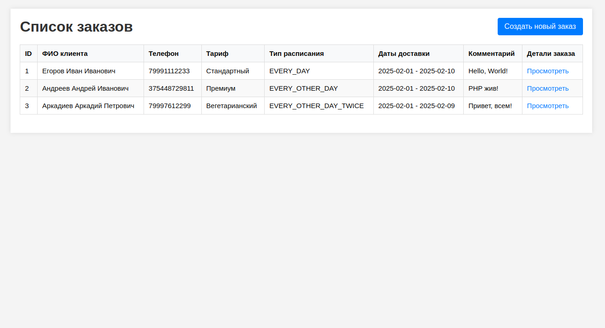
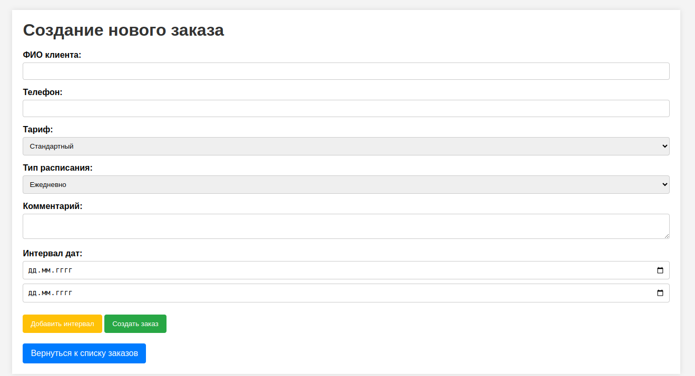
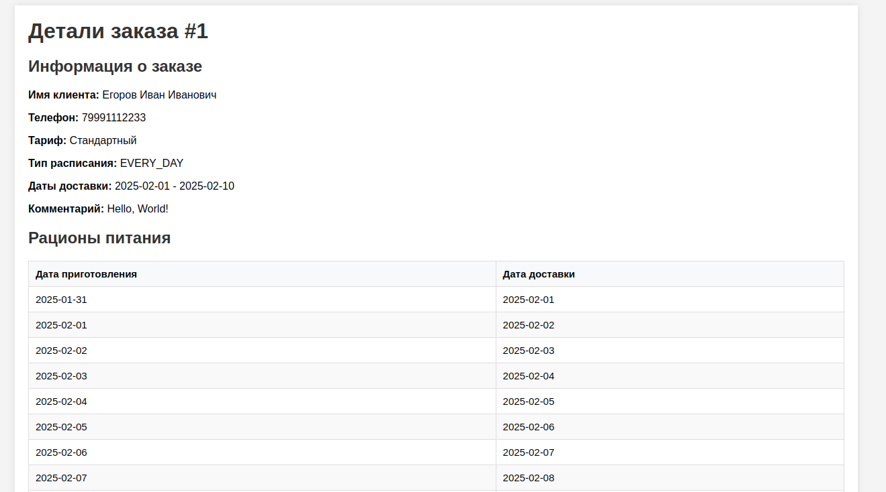

# Subscription orders - приложение для управления заказами питания по подписке 🍽️

## Описание проекта
Этот проект был разработан в рамках [тестового задания](https://github.com/privatecrm/back-task). Приложение позволяет создавать заказы на доставку питания по подписке и просматривать их. Заказ состоит из нескольких рационов питания, которые доставляются в соответствии с выбранным расписанием и тарифом.

## Функциональные возможности:
- Создание заказов с определённым расписанием доставки и тарифом
- Автоматическое создание рационов питания для заказа
- Просмотр всех заказов и детальная информация о каждом заказе, включая рацион

## Стек технологий:
- **Backend**: Laravel (PHP 8.3)
- **База данных**: MySQL 8.0
- **Веб-сервер**: Nginx
- **Контейнеризация**: Docker, Docker Compose

## Установка

### 1. Клонируйте репозиторий:

```bash
git clone https://github.com/Andrey-Yurchuk/subscription-orders.git
```
### 2. Перейдите в директорию проекта:

```bash
cd subscription-orders
```

### 3. Настройте файл окружения:

В корне проекта вы найдете файл .env.example, который содержит пример настройки переменных окружения для проекта.
Скопируйте его в файл .env:

```bash
cp .env.example .env
```
Откройте файл .env и для получения значения ключа приложения `APP_SECRET` сгенерируйте его с помощью следующей команды:

```bash
docker-compose exec php php artisan key:generate
```
После генерации ключа укажите его значение в `APP_SECRET`

### 4. Настройте подключение к базе данных:

В файле .env настройте учетные данные для работы с базой данных MySQL:

```bash
DB_CONNECTION=mysql
DB_HOST=mysql
DB_PORT=3306
DB_DATABASE=subscription_orders
DB_USERNAME=<ваш_пользователь>
DB_PASSWORD=<ваш_пароль>
```

### 5. Запустите Docker-контейнеры:

Для сборки и запуска Docker-контейнеров выполните следующие команды:

```bash
docker-compose build
docker-compose up -d
```
После сборки и запуска в рабочем состоянии должны находится следующие Docker-контейнеры:
- php
- mysql
- nginx

### 6. Выполните миграции:

Для создания необходимых таблиц в базе данных выполните миграции:

```bash
docker exec -it php php artisan migrate
```
Затем выполните сидирование для добавления тарифов в таблицу:

```bash
docker exec -it php php artisan db:seed --class=TariffSeeder
```
После выполнения данных команд прижение готово к работе

### 7. Просмотр и создание заказов:

Для просмотра списка заказов перейдите на http://localhost:8080 или на http://localhost:8080/orders



Для создания нового заказа откройте http://localhost:8080/orders/create



Для просмотра конкретного заказа перейдите по адресу http://localhost:8080/orders/{id}, где {id} — это номер заказа



_На скриншотах выше показан пользовательский интерфейс приложения Subscription orders_

